<p align="center">
  
</p>

# GlassReborn

GlassReborn is a two-app system that revives the Google Glass Explorer Edition (XE) as a modern heads-up display. A custom Android launcher runs on Glass, while a companion iPhone app bridges Glass to the outside world via Bluetooth and WiFi.

```
┌──────────────────────────┐          BLE (GATT)         ┌──────────────────────────┐
│     Google Glass XE      │ ◄─────────────────────────► │      iPhone App          │
│   Android 4.4 (API 19)   │                             │  iOS 16+  (SwiftUI)      │
│                          │          WiFi (WebSocket)   │                          │
│  Launcher + Camera + AI  │ ◄─────────────────────────► │  Notifications + Gallery │
└──────────────────────────┘                             └──────────────────────────┘
```

---

## What it does

| Feature | Glass | iPhone |
|---|---|---|
| **Status card** | Shows time, date, BLE status, battery levels | Connection dashboard |
| **Notifications** | Full-screen overlay for phone alerts and calls | Forward via iOS Shortcuts or manual push |
| **Camera** | Live preview + capture; remotely triggerable | Auto-downloads new photos over WiFi |
| **AI assistant** | Tap-to-speak; streams Claude response word-by-word | Calls Claude API; relays streaming chunks |
| **Gallery** | Horizontal carousel of Glass photos | Browse, download, and save photos to Camera Roll |

---

## Repository layout

```
GlassReborn/
├── app/          Android app — runs on Google Glass XE
│   └── README.md    Full Android docs
├── ios/          iOS companion app — runs on iPhone
│   └── README.md    Full iOS docs
└── SETUP.md      One-time hardware setup (ADB commands, Glass configuration)
```

---

## How the two apps communicate

### BLE (control plane)

The iPhone acts as a **BLE peripheral** — it advertises as `GlassReborn`. Glass acts as a **BLE central** — it scans, finds the iPhone, and connects.

All control messages (notifications, AI responses, battery levels, photo triggers, timezone) travel over BLE as JSON, chunked into 20-byte packets to work within the Glass API 19 MTU limit.

```
Chunk format (20 bytes max):
  [msgId:1][chunkIdx:1][totalChunks:1][UTF-8 payload: up to 17 bytes]
```

Both sides use identical chunking/reassembly logic (`GlassProtocol.kt` / `GlassProtocol.swift`).

### WiFi (data plane)

Photos are too large for BLE. When BLE connects, Glass sends its local WiFi IP to the iPhone. The iPhone opens a WebSocket to `ws://<glass-ip>:8765` and uses it for gallery listing and photo downloads.

---

## BLE message reference

| Type | Direction | Purpose |
|---|---|---|
| `NOTIF` | iPhone → Glass | Phone notification (app, title, body) |
| `CALL_START` | iPhone → Glass | Incoming call (name, number) |
| `CALL_END` | iPhone → Glass | Call ended |
| `AI_RESP` | iPhone → Glass | Streamed AI response chunk |
| `PHONE_BATT` | iPhone → Glass | iPhone battery percentage |
| `PHOTO_TRIG` | iPhone → Glass | Remote camera shutter |
| `TIMEZONE` | iPhone → Glass | IANA timezone string for the Glass clock |
| `CMD` | Glass → iPhone | Command (voice query, gallery list request, etc.) |
| `STATUS` | Glass → iPhone | Glass WiFi IP + WebSocket port |

---

## Quick start

### 1 — One-time Glass setup

See [SETUP.md](SETUP.md) for the full walkthrough. The short version:

```bash
# Disable Glass system services that block input
adb shell pm disable com.google.android.glass.systemui
adb shell pm disable com.google.glass.gesture
adb reboot

# Connect Glass to WiFi (one-time)
adb shell am start -n com.glass.companion/.WifiSetupActivity \
    --es ssid "YourNetwork" --es password "YourPassword"
```

### 2 — Build and install the Android app

```bash
# From the repo root
JAVA_HOME="/Applications/Android Studio.app/Contents/jbr/Contents/Home" \
    ./gradlew assembleDebug
adb install -r app/build/outputs/apk/debug/app-debug.apk
```

### 3 — Build and install the iOS app

Open `ios/GlassReborn/GlassReborn.xcodeproj` in Xcode, select your iPhone as the run destination, and press Run.

### 4 — Connect

1. Open the iPhone app — it starts advertising over BLE immediately.
2. Wake Glass — it scans and connects automatically.
3. The status dot on Glass turns green; the iPhone Connection tab shows "Glass connected ✓".

---

## Screenshots

### Glass

<table>
  <tr>
    <td align="center">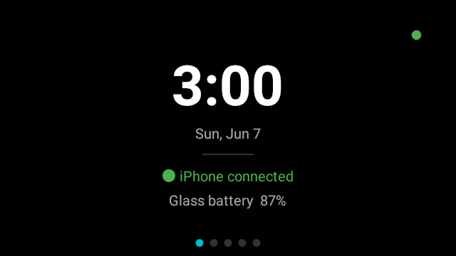<br/><sub>Home</sub></td>
    <td align="center">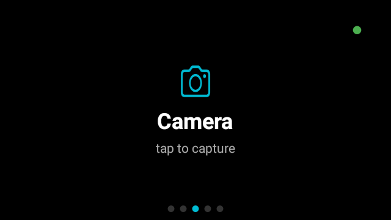<br/><sub>Camera</sub></td>
    <td align="center">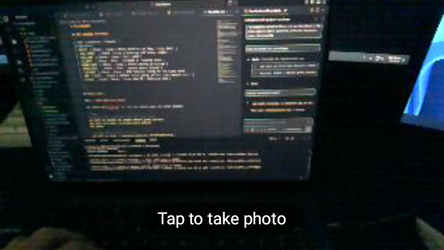<br/><sub>Camera preview</sub></td>
  </tr>
  <tr>
    <td align="center">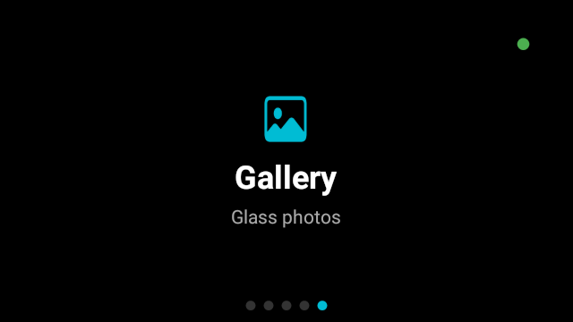<br/><sub>Gallery</sub></td>
    <td align="center">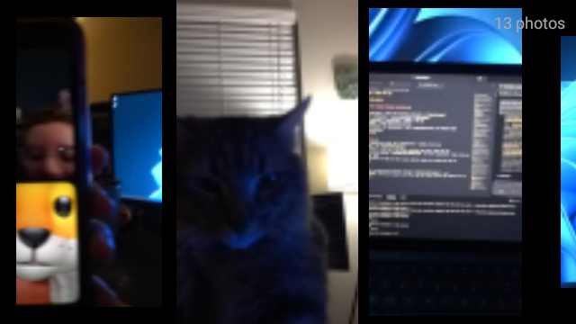<br/><sub>Gallery detail</sub></td>
    <td align="center">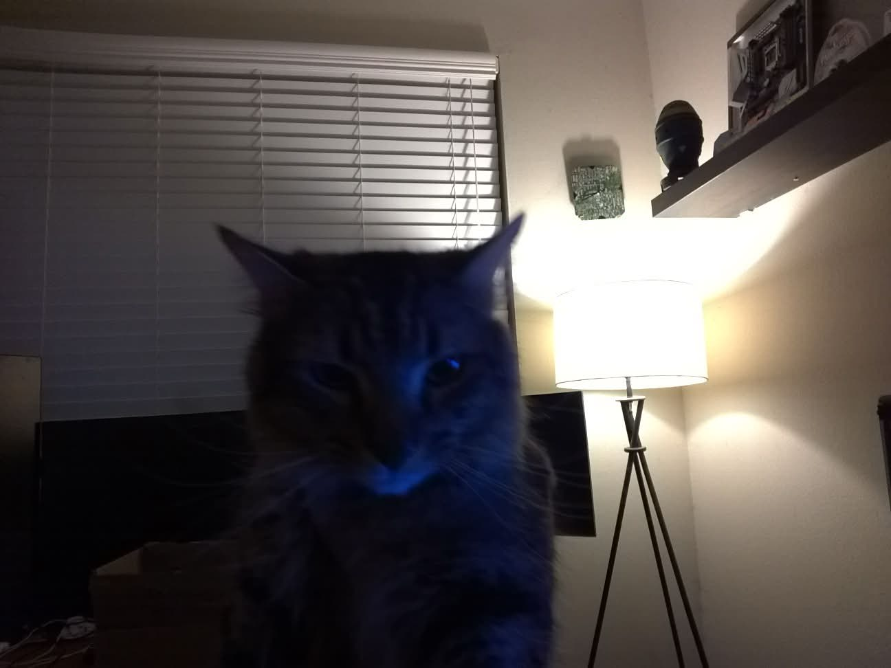<br/><sub>Example photo</sub></td>
  </tr>
  <tr>
    <td align="center">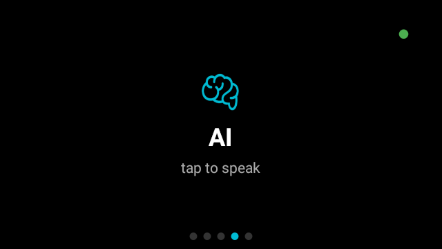<br/><sub>AI assistant</sub></td>
    <td align="center">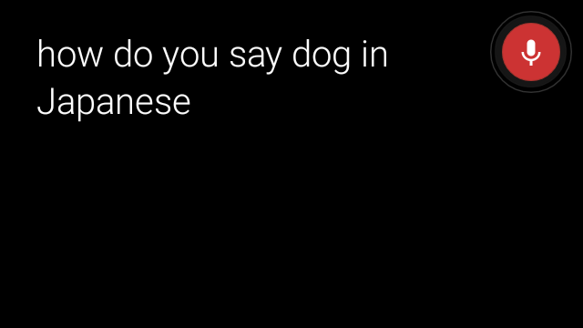<br/><sub>AI response</sub></td>
    <td align="center">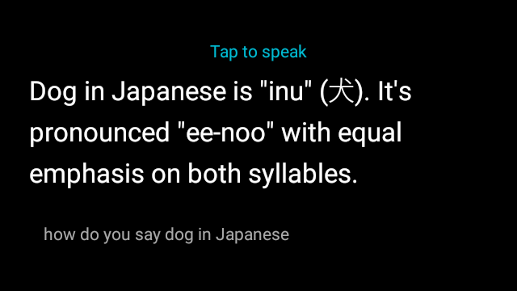<br/><sub>AI scrolling</sub></td>
  </tr>
</table>

---

### iPhone

<table>
  <tr>
    <td align="center">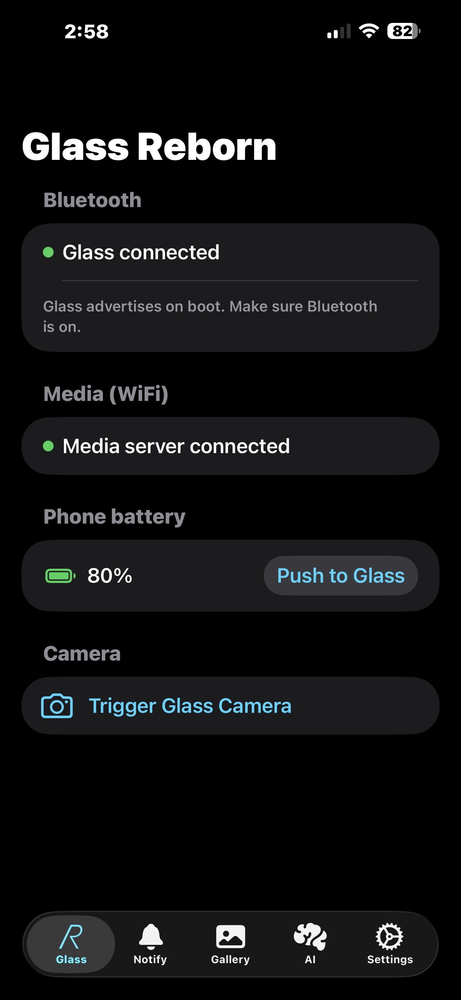<br/><sub>Connection</sub></td>
    <td align="center">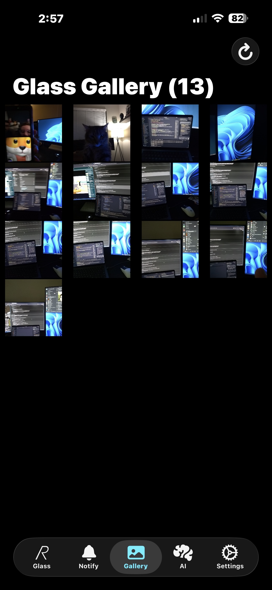<br/><sub>Gallery</sub></td>
    <td align="center">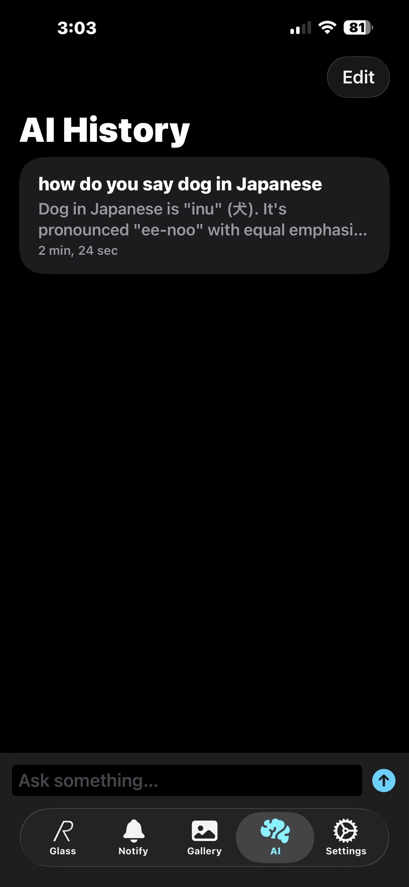<br/><sub>AI history</sub></td>
    <td align="center">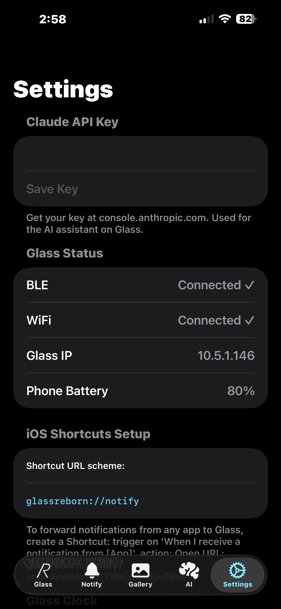<br/><sub>Settings</sub></td>
  </tr>
</table>

---

## Requirements

| Component | Requirement |
|---|---|
| Glass hardware | Google Glass Explorer Edition XE12 or XE22 |
| Glass OS | Android 4.4.2 (API 19) |
| iPhone | iOS 16 or later |
| Xcode | 15 or later |
| Android build | JDK 17 (via Android Studio's bundled JBR), Gradle 8.9, AGP 8.x |
| Claude API key | Required for AI assistant — enter in iPhone app Settings |
